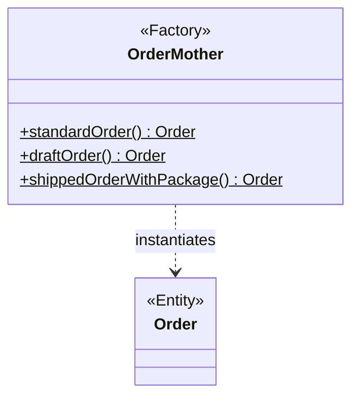
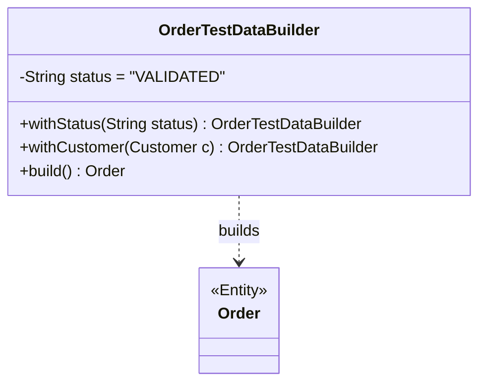
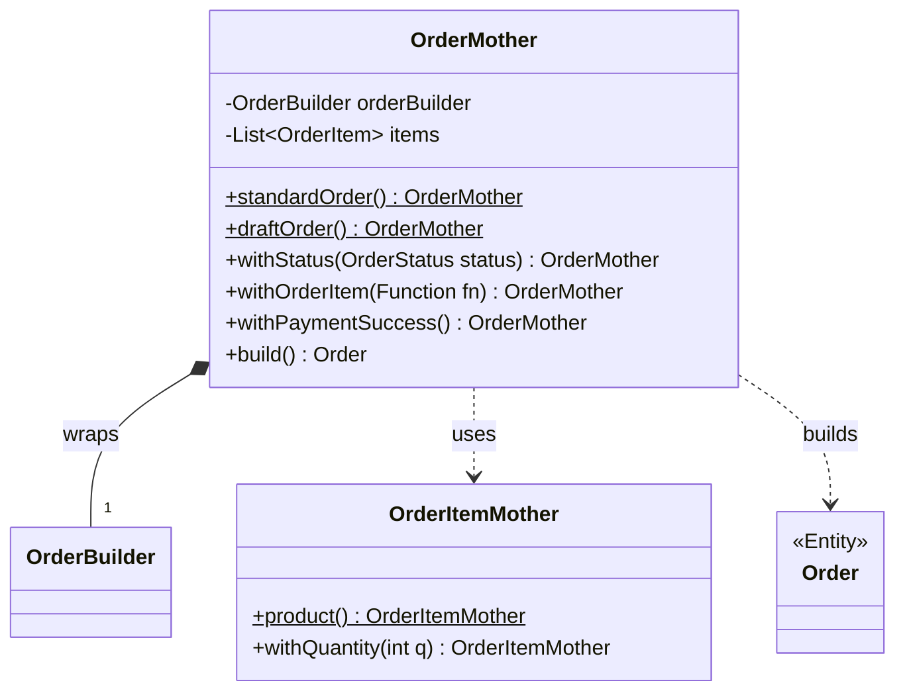
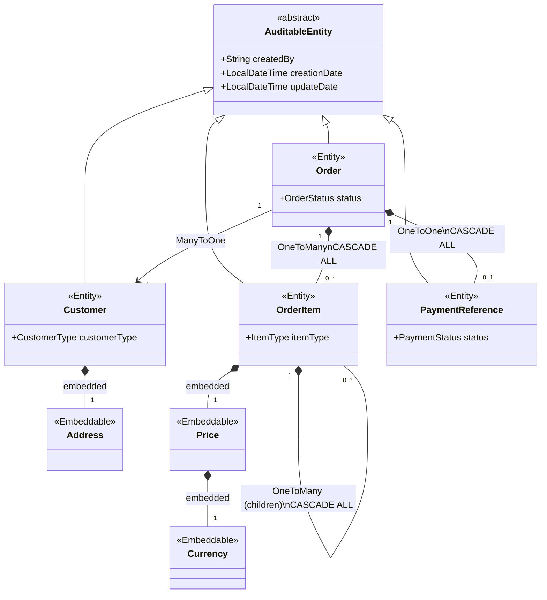

# **🧬 Demo: Object Mother \+ Test Data Builder for JPA**

Test architecture demonstration project applying the **Object Mother \+ Test Data Builder** pattern on a JPA/Hibernate
persistence layer with Spring Boot.  
This repository aims to compare different data preparation approaches (Fixtures) for ORM integration tests, and to
demonstrate how to combine **business readability**, **maintainability**, and **technical safety**.

## **1\. The Problem: Limitations of Classic Approaches**

A good ORM test doesn't just check that the code compiles; it must validate the actual behavior of the mapping (foreign
keys, cascades, lazy-loading) against the database.  
In this project, the OrderRepositoryTest class has been split into three to illustrate the different approaches:

### **❌ The SQL Approach (SqlOrderRepositoryTest)**

Data is loaded via the @Sql annotation.

* **Readability: Poor.** The business intent is hidden. You have to open opaque external .sql files to understand the
  tested data.
* **Maintainability: Bad.** Adding a mandatory column silently breaks all scripts. You have to do a search/replace
  without the compiler's help.
* **Reliability: Low.** SQL inserts data directly, bypassing the JPA lifecycle. The test might pass even if the Java
  code is actually unable to persist this object.

### **⚠️ The Native Builder Approach (BuilderOrderRepositoryTest)**

Data is instantiated manually via Lombok @Builder in each test.

* **Readability: Bad.** The business intent is drowned in 60 lines of variable instantiation (Currency, Address, Price).
  The "Given" takes up 90% of the test.
* **Maintainability: Bad.** Each test manually instantiating the entity will generate a compilation error if the model
  evolves.
* **Reliability: Average.** The risk of human error (forgetting to link a child to its parent or adding it to a list)
  creates false positives that are very hard to debug.

### **✅ The Hybrid Approach: Mother \+ Builder (MotherOrderRepositoryTest)**

* **Readability: Excellent.** The intent is obvious. The code tells a business story (e.g., "Standard order with
  successful payment").
* **Maintainability: Excellent.** The point of change is centralized in the Mother's factory. You modify one file, all
  tests work again.
* **Reliability: Excellent.** The Mother class handles the internal "plumbing" (adding to lists, bidirectional links).
  Human error is physically prevented.

## **2\. Theory and Patterns**

* **Fixture:** Known and fixed initial state of the environment required to run a test (deterministic context).
* **Object Mother:** Design pattern (factory) containing static methods that return pre-configured objects in specific
  states (e.g., standardOrder()).
* **Test Data Builder:** Adaptation of the Builder pattern for tests, exposing fluent methods (withX()) to override only
  the relevant fields.

This repository implements a **mixed solution**: the Mother returns an encapsulated instance of the Builder, allowing
fluent overriding while keeping internal business rules secure.

### **UML Comparison of Paradigms**

💡 **ORM Mapping tip to facilitate the Builder:**  
In order to simplify the construction of your test objects, design your entities so that only one entity holds the
reference (favor unidirectional from the aggregate root). For example, it's Order that references its OrderItem and
Customer. Even if at the physical database level it's the child table (e.g., order\_items) that holds the foreign key,
using a @JoinColumn on the parent's collection in JPA allows the Mother to simply do a this.items.add(item) without ever
having to manage a time-consuming inverse association (item.setOrder(this)).

#### **1\. "Pure" Object Mother**



#### **2\. "Pure" Test Data Builder**



#### **3\. Mixed Solution (This project)**



## **3\. Business Data Model**

The project relies on a complex aggregate typical of e-commerce to demonstrate the pattern's effectiveness against
complexity.



### OrderItem composition rules:

* `PRODUCT` : nothing (leaf).
* `SERVICE` : can contain `PRODUCT`s.
* `PACKAGE` : can contain `PACKAGE`s, `SERVICE`s, or `PRODUCT`s.

## **4\. Points of Attention for the Mixed Approach**

This solution is not magic and comes with its own architectural trade-offs:

1. **Entry Cost (Boilerplate):** Writing an OrderMother takes time. Limit the use of this pattern to **Root Aggregates**
   and entities at the core of the domain.
2. **The "God Class" Trap:** Only create mutation methods (withX()) for fields that genuinely vary your test scenarios.
   It is useless to map 100% of the technical attributes if they are never specifically tested.
3. **State Leak (Mutability):** When the Mother manages internal collections, the build() method must ALWAYS return a *
   *defensive copy** (new ArrayList<>(this.items)).

    * **⚠️ The One-Liner Rule:** To avoid unintentional state accumulation across builds, **you must always use the
      Mother as a one-liner**. Do not instantiate a Mother to reuse it across multiple variables.

   ```java
   // ✅ GOOD: Isolated state
   Order orderA = OrderMother.standardOrder().withProduct().build();
   Order orderB = OrderMother.standardOrder().withStatus(OrderStatus.DRAFT).build();
   
   // ❌ BAD: orderD will unintentionally inherit the product from orderC!
   OrderMother mother = OrderMother.standardOrder();
   Order orderC = mother.withProduct().build();
   Order orderD = mother.withStatus(OrderStatus.DRAFT).build(); 
   ```

## **5. Going Further: Advanced Improvements**

If you want to make this architecture "production-ready" for a large team, here are advanced patterns you can implement:

### **A. Immutable Mothers with `@Builder(toBuilder = true)`**

If you want to completely eliminate the "State Leak" risk and safely allow the reuse of Mother instances as shared
templates, you can upgrade this architecture using Lombok's `toBuilder = true` feature.
By annotating your entity with `@Builder(toBuilder = true)`, the Mother no longer stores a mutable `Builder` object, but
an **immutable entity template**. Every time a `withX()` method is called, it generates a strictly new isolated copy.

```java

@RequiredArgsConstructor(access = AccessLevel.PRIVATE)
public class OrderMother {
    private final Order template;
    private final List<OrderItem> items;

    private static final Order BASE_ORDER = Order.builder()
            .orderReference("REF-BASE")
            .status(OrderStatus.VALIDATED)
            .build();

    public static OrderMother standardOrder() {
        return new OrderMother(BASE_ORDER, new ArrayList<>());
    }

    public OrderMother withStatus(OrderStatus status) {
        Order newTemplate = this.template.toBuilder().status(status).build();
        return new OrderMother(newTemplate, new ArrayList<>(this.items));
    }

    public Order build() {
        return this.template.toBuilder()
                .items(new ArrayList<>(this.items))
                .build();
    }
}
```

### **B. Handling Bidirectional Relationships (`mappedBy`)**

For performance reasons, JPA/Hibernate often prefers bidirectional relationships using `mappedBy` (which saves an extra
`UPDATE` statement during insertion). You can easily hide the complexity of the bidirectional wiring inside the Mother's
`.build()` method:

```java
public Order build() {
    Order order = this.orderBuilder // or this.template.toBuilder()
            .items(new ArrayList<>(this.items))
            .build();

    // The Mother automatically handles the bidirectional plumbing!
    if (order.getItems() != null) {
        order.getItems().forEach(item -> item.setOrder(order));
    }

    return order;
}
```

### **C. Randomization with Datafaker**

If your database schema relies on `UNIQUE` constraints (e.g., `@Column(unique = true)` on an email), calling
`CustomerMother.defaultCustomer()` twice in the same test context will crash with a `DataIntegrityViolationException`.
You can integrate a library like [Datafaker](https://www.datafaker.net/) to generate unique data for fields requiring
high entropy:

```java
private static final Faker FAKER = new Faker();

public static CustomerMother defaultCustomer() {
    return new CustomerMother(
            Customer.builder()
                    .firstName(FAKER.name().firstName())
                    .lastName(FAKER.name().lastName())
                    // Unique at each call, safe for UNIQUE database constraints
                    .email(FAKER.internet().emailAddress())
                    .build()
    );
}
```

## **6\. Tech Stack & Execution**

| **Layer**   | **Technology**                             |  
|-------------|--------------------------------------------|
| Framework   | Spring Boot 3.x / 4.x                      |  
| Persistence | Spring Data JPA · Hibernate                |  
| Database    | PostgreSQL 16                              |  
| Testing     | JUnit Jupiter 5 · AssertJ · Testcontainers |  
| Utilities   | Lombok                                     |

### **Running tests**

**Prerequisite:** The Docker daemon must be running on your machine (Testcontainers will spin up an ephemeral PostgreSQL
container on the fly).

```
./mvnw clean test
```

## **7. Project Structure**

```text
src/
├── main/java/com/demo/motherbuilder/
│   ├── config/
│   │   └── JpaAuditingConfiguration.java  # @EnableJpaAuditing + AuditorAware
│   ├── entity/                            # JPA Entities & value objects
│   │   ├── Customer.java
│   │   ├── Order.java
│   │   ├── OrderItem.java
│   │   └── ...
│   └── repository/
│       └── OrderRepository.java
└── test/java/com/demo/motherbuilder/
    ├── mother/                            # Pattern Implementations
    │   ├── AddressMother.java
    │   ├── CustomerMother.java
    │   ├── OrderItemMother.java
    │   └── OrderMother.java               # Aggregate Root
    ├── SqlOrderRepositoryTest.java        # Demo of the @Sql approach
    ├── BuilderOrderRepositoryTest.java    # Demo of the classic Builder approach
    └── MotherOrderRepositoryTest.java     # Demo of the target approach